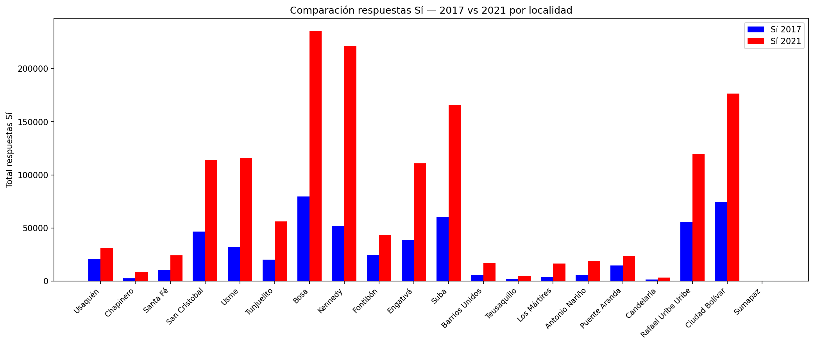

# Malnutrition Analysis in Bogotá — 2017 vs 2021

Analysis of malnutrition rates across Bogotá's 20 localities, comparing 2017 and 2021 data through population projections, percentage breakdowns, and an interactive choropleth map.

---

## Project Structure

Alimentacion/
├── Analisis_Alime.ipynb       # Main analysis notebook
├── bogota_mapa.html           # Interactive map (open in browser)
├── Bogota (1).xls             # Population growth rate — DANE
├── indicadorloc (1).json      # Bogotá localities GeoJSON — DANE
└── osb_seguridad_alimentaria-alimentacionsaludable.csv  # Malnutrition survey — DANE

---

## Data Sources

| Dataset | Source | Format |
|---|---|---|
| Malnutrition survey by locality | DANE | CSV |
| Population growth rate | DANE | XLS |
| Bogotá localities boundaries | DANE | GeoJSON |
| 2018 Census population by locality | *Constructed manually* from "Pasado, Presente y Futuro de Bogotá" — Secretaría de Planeación, Alcaldía de Bogotá | DataFrame |

---

## Methodology

1. **Population projections** — 2018 census data projected to 2017 and 2021 using DANE's exponential growth rate
2. **Malnutrition estimates** — percentage answering "Sí" to food insecurity, applied to projected populations
3. **Geospatial visualization** — localities matched to GeoJSON and rendered as an interactive map

---

## Technologies Implemented:

- `pandas` — data manipulation
- `numpy` — numerical calculations
- `matplotlib` — bar chart visualization
- `folium` — interactive map
- `geopandas` — geospatial data handling
- `unicodedata` — text normalization for locality name matching

---
## Results

The present graph aims to illustrate the data collected through surveys conducted in 2017 and 2021 among the population of Bogotá. The survey functions as an indicator that measures the proportion of households in which, during the last 30 days and due to a lack of money or other resources, the head of the household reported that at least one member did not have access to healthy food.

On the X-axis, the different localities of the city of Bogotá are presented, while the Y-axis illustrates the total number of surveyed people in each locality. The graph displays two bars for each locality: a blue bar corresponding to the population surveyed in 2017 and a red bar corresponding to the population surveyed in 2021.

The graph shows that, during the period between both surveys, the number of people who answered “Yes” increased overall in 2021 compared to 2017. Likewise, it can be observed that the localities where the highest increase in affirmative responses was concentrated are mainly located in the southern and western areas of the city.

It should be noted that, in 2020, one year before the second survey was conducted, the SARS-CoV-2 (COVID-19) pandemic occurred, an event that may have influenced the results obtained in the 2021 survey.

One of the limitations that should be considered when analyzing the collected data is that, as of today (05/08/2026), no new updates or additional applications of the survey have been carried out.

---
## Interactive Map

Open `bogota_mapa.html` directly in any browser — no server or internet connection required.
Hover over each locality to see population, malnutrition percentage, and total affected population for both years.
